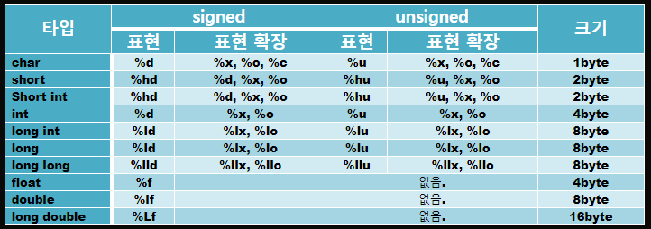
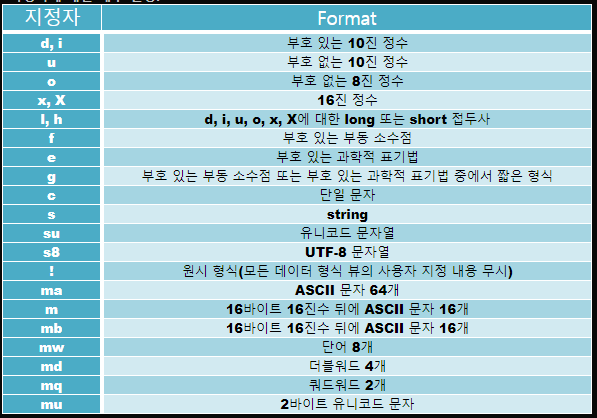

# 상수와 데이터 출력
## 제어문자

- \t, \b, \r, \n모두 커서 이동.  Tab의 크기는 컴파일러에 따라 다를 수 있다.
    - \t - tab키. 컴파일러에 따라 다른 듯
    - \b - 지워지는 게 아니라, 커서 이동만 일단 한다. 다시 커서 이동 없이 글자를 쓰면 그대로 덮어 씌워지고, \t, \b,\r ,\n 등 커서 이동하면 이동된 곳에서부터 작성됨.
- \a -벨소리

## 변환문자

- %f와 %lf의 차이
- **034p- 수식(?)**
- %o → 8진수 출력
- %x → 16진수 출력
- %le, %e → 지수형태 출력
- %hd → short형.   h는 half라는 뜻  (출력 변환문자는 %d)
- %ld - long
- %lld - long long
- %f - float
- **%lf** - double
- %Lf - long double

## 정수

- 2의 보수 +1 을 하면 부호가 바뀐다.  (~n+1)  . 양.음수 모두 해당
- **signed int에서 어떤 범위가 양수, 음수인지?**

## 실수

- 정규화 표기법
- 상수는 크기에 따라 컴파일러가 자동변환한다.

## 궁금한 것
* main이 return 0을 할 때와 안 할 때의 차이?