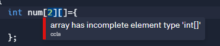
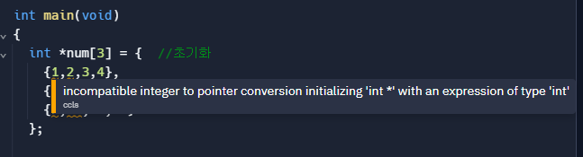
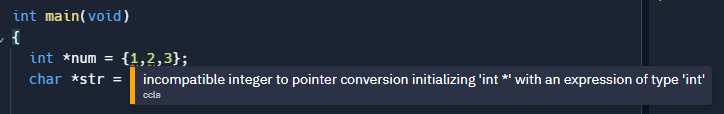

# CH14 다차원 배열과 포인터 배열

## 다차원 배열의 필요

- 분류 조건이 2개 이상인 경우 필요하다.

## 요약

- 배열 안에 배열을 넣어서 다차원 배열을 표현할 수 있다.
    
    → 배열로 이루어진 배열이 다차원 배열이다.
    
- 메모리에서는 다차원 배열의 요소들이 모두 연속적인 메모리이다.
    - 첫번째 배열 옆에 다음 배열이 시작한다.
- **문자열의 배열을 만들기 위해서는 2차원 배열이 필요**하다.
    - 문자’열’ 자체가 배열이므로, 문자열의 배열은 ‘배열의 배열’(=2차원 배열)이다.
    - 각 문자열의 크기가 다를 수도 있다.
    - **1차원 배열 아님에 유의**

- 포인터도 자료형이므로 배열로 선언할 수 있다.
    - 모여있는 포인터의 주소는 연속적임.
    - **포인터들이 가리키는 주소들은 연속적이지 않을 수 있다**.
        - 배열과의 차이점
        - 메모리상 **떨어져 있는 데이터들, 변수들도 모아서  배열로 만들 수 있다.**
    - 포인터들이 1차원 배열을 가리키면, 포인터 배열은 2차원 배열처럼 쓸 수 있다.
        - 각 배열의 크기가 다르게도 할 수 있다.

## 문법

### 이차원 배열

```c
int score[3][4];  //선언.  (3행 4열인 2차원 배열 선언)
score[2][1] = 1;  //값 접근   (3행 2열에 대입)

int num[3][4] = {  //초기화 
	{1,2,3,4},
	{5,6,7,8},
	{9,10,11,12}
};

int num[3][4] = {  //일부 요소 생략
	{1},
	{5,6},
};
//1 0 0 0    결과값
//5 6 0 0 
//0 0 0 0

int num[3][4] = {1,2,3,4,5,6};  // 연속 메모리이므로 순서대로 초기화.  안채워진부분 0으로 초기화
//1 2 3 4
//5 6 0 0
//0 0 0 0

int num[][4] = { {1},{2,3},{4,5,6} }; //1차원 배열에서 크기를 정하지 않을 때처럼 자동으로 크기가 정해짐

int num[][4] = {1,2,3,4,5,6};   // 4열로 알아서 끊어주고, 크기도 자동으로 정해진다.
//1 2 3 4
//5 6 0 0
//0 0 0 0

```

- 행의 수, 열의 수

```c
int num[3][4];
int row = sizeof(num)/sizeof(num[0]);      //행의 갯수
int col = sizeof(num[0])/sizeof(num[0][0]); //열의 갯수
printf("row:%d,col:%d",row,col);
```

- 초기화 시 열의 수를 생략할 수는 없을까? `int num[3][]`
    
    → 없다.    아래는 개인적인 설명.
    
    - 배열은 요소의 크기를 알아야 메모리를 할당 할 수 있다.
    - 2차원 배열은 배열의 배열인데, 요소가 되는 배열의 크기는 안에 있는 요소의 수를 알아야 결정되므로 생략될 수 없다.
    
    ```c
    int num[3][];  //이렇게 두 줄 다
    int num[][];  //컴파일 에러
    ```
    
    
    
    - 생략 하려면 배열의 배열이 아닌, 포인터의 배열을 쓰자.
        
        ```c
        int *num[3];
        ```
        
        - 이 때, 각 포인터는 배열명을 가리켜야 안전하다.
        - 길이도 알면 더 안전하다
        - 실험예제
            
            ```c
            #include <stdio.h>
            
            int main(void)
            {
              int* num[3];
              int arr1[2] = {1,2};
              int arr2[3] = {4,5,6};
              
              int a = 4;
              int *n = &a;
              
              num[0] = arr1;
              num[1] = arr2;
              num[2] = n;
            
            }
            ```
            
- 초기화 시, 크기를 넘어가는 배열은?
    
    ```c
    //int 형
    int main(void)
    {
      int str[2][3]={
        {1,2,3,4},
        {1,2,3,4}
      };
      printf("%d",str[1][0]);    //1
    }
    
    //char형
    int main(void)
    {
      char str[2][3]={
        "catastrophy","dog"
      };
      printf("%s",str[0]);   //catdog
    }
    //크기를 3으로 했기 때문에 마지막 '/0'이 안들어가면서 끝까지 다음 요소까지 출력
    //dog뒤에서는 어떻게 멈췄는지는 의문
    ```
    
    - 알아서 잘라서 주소에 넣는 것으로 보인다.
    

### 2차원 char 배열

```c
char animal[5][20]  //선언
scanf("%s",animal[i]) // 전체 배열의 각 요소가 배열명이므로, &없이 사용 가능

//초기화
char animal[5][10]= { {'d','o','g','\0'},{'c','a','t','\0'} };
//일부 생략 가능
//마지막에 null 넣어줘야 함
char animal[][10]={"dog","cat"};
//행 생략 가능 
```
### 3차원 배열

```c
int scre[2][3][4]
```

- 2차원 배열과 같은 원리로 요소 생략시 자동 초기화가 실행된다.
- 2차원 배열과 같은 맥락으로 2차,3차 배열의 크기는 생략이 불가능하다.
- **복잡할 수 있으므로 특별한 상황에서만 쓰는 것이 좋다.**
    - 3차 포인터도 마찬가지

### 포인터 배열

```c
char *pary[5] //char pary[5][] 논리상 이 코드와 같다.(주소는 붙어있지 않음)
int *iary[5] //int ary[5][]

char *pary[5] ={"dog","elephant","cat"};  //char 포인터 배열은 특별함.
```

- char 포인터 배열은 특별히 위와 같이 선언 가능하다.
- 다른 타입의 포인터 배열은 불가능
    
    ```c
    int *num[3] = {  //초기화 
      	{1,2,3,4},
      	{5,6,7,8},
      	{9,10,11,12}
      };
      char *str[3]= {
        {'d','o','g','\0'},
      };
    ```
    
    
    
    - 아래 코드가 불가능하기 때문
    
    ```c
    int *num = {1,2,3};
    char *str = "dog"; //이건 됨
    ```
    

## 도전실전예제

- 내 풀이
    
    ```c
    #include <stdio.h>
    
    int main() {
    
      int ary[5][6] = {
        {1,2,3,4,5},
        {6,7,8,9,10},
        {11,12,13,14,15},
        {16,17,18,19,20}
      };
      
      for(int i=0;i<4;i++)
      {
        int sum = 0;
        for(int j=0;j<5;j++)
        {
            sum+=ary[i][j];
        }
        ary[i][5] = sum;
      }
    
      for(int i=0;i<6;i++)
      {
        int sum = 0;
        for(int j=0;j<4;j++)
        {
            sum+=ary[j][i];
        }
        ary[4][i] = sum;
      }
    
      for(int i=0;i<5;i++)
      {
        for(int j=0;j<6;j++)
        {
            printf("%5d ",ary[i][j]);
        }
        printf("\n");
      }
      
      return 0;
    }
    ```
    
- 정답 풀이 - 반복을 덜 쓰기
    
    ```c
    for(i = 0; i < 4; i++)
     {
           for(j = 0; j < 5; j++)
           {
                ary[4][j] += ary[i][j];
                ary[i][5] += ary[i][j];
                ary[4][5] += ary[i][j];
           }
     }
    ```
    
    - 배열의 빈 index를 sum 변수처럼 쓰는 방법도 있다!